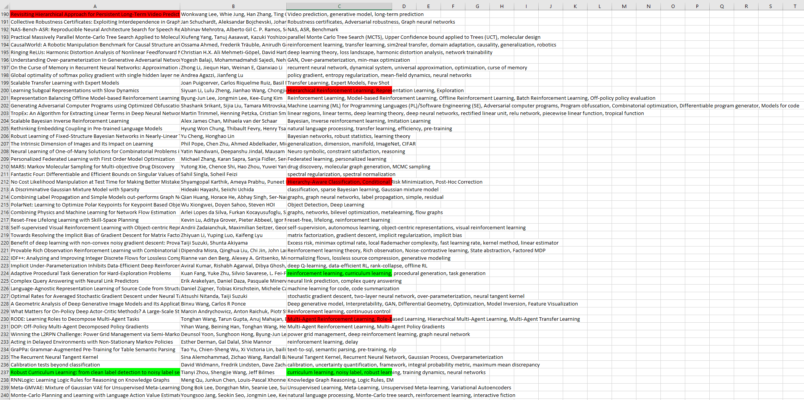

# Conference Paper Highlighter
This script saves the articles from the chosen conference/workshop in an excel spreadsheet. It is using the [OpenReview](https://openreview.net/) website as reference. 

You are also given the option of highlighting 4 words using conditional formatting. Here's an example of ICLR 2021 conference results:

